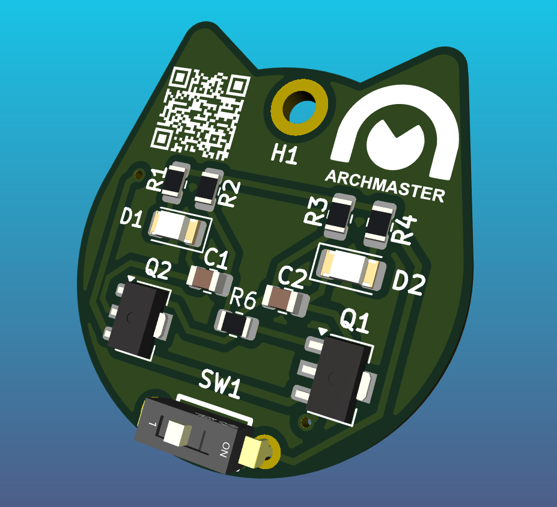
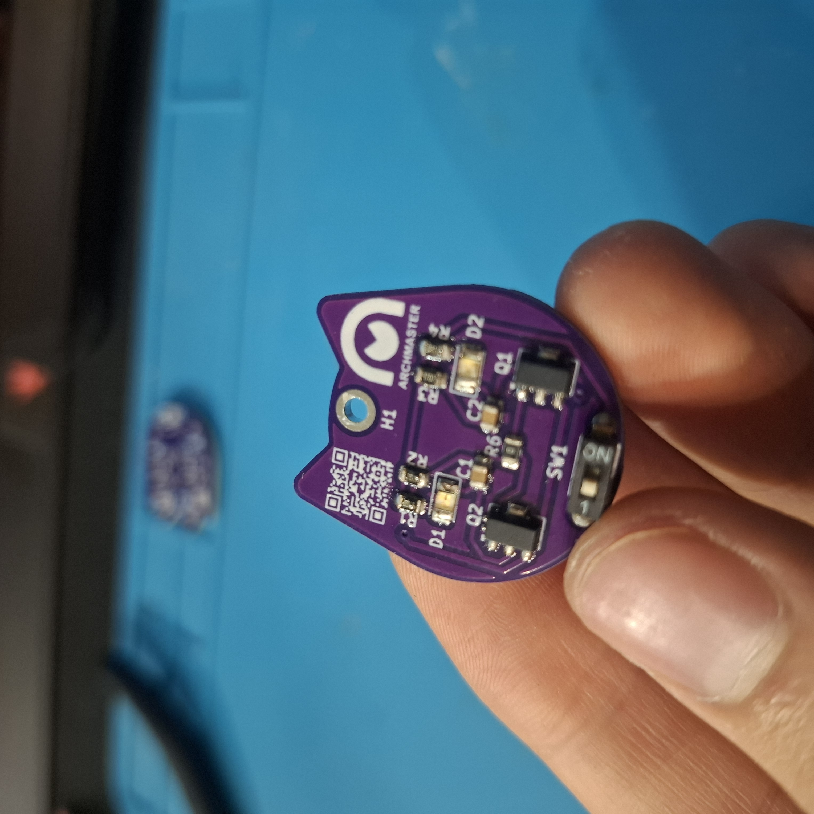
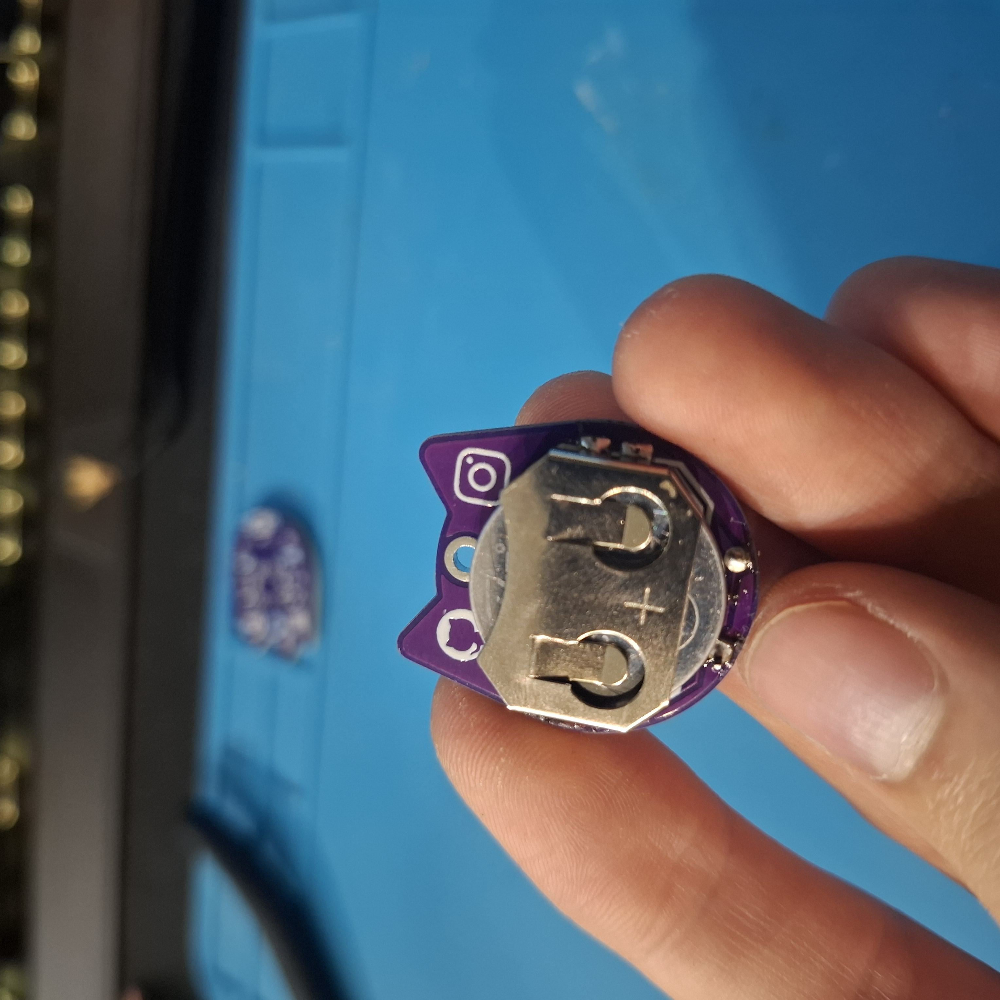

# 🐱 Kitty Blinky Earrings

This project is a **pair of kitty-shaped PCBs** designed as earrings for my beloved wife 💖.  
Each earring is powered by a CR2032 coin cell and blinks two LEDs in an alternating pattern (classic astable multivibrator style 🟡🟢).  

It’s a mix of **electronics + wearable art**, made as a gift 💝.

## 🥂 Shoutout to the sponsor of the project

  

  This project was proudly prototyped with support from
  <a href="https://www.pcbway.com/?from=github"><b>PCBWay</b></a>. 
  Their precision manufacturing, excellent finish quality, and quick lead times made this build possible.
  Check out their site and PCB manufacturing capabilities and good luck!

---

## ✨ Features
- Kitty-shaped PCB outline 😺
- Two LEDs blinking one after another (0.5 Hz)
- Powered by a CR2032 battery (≈220 mAh)
- Minimal BOM (two transistors, resistors, capacitors, LEDs, battery holder)
- Works as earrings or just a tiny blinking desk buddy

---

## 🛠️ How It Works
- Simple transistor astable multivibrator  
- No microcontroller, no 555 timer, just pure retro discrete-component charm  
- Each side alternately lights an LED, making the kitty “sparkle”

---

## 🎁 Why?
Because sometimes the best gifts are the ones you solder yourself ❤️

---

## 🧩 Folder Contents (not ready yet)
- `schematic/` → KiCAD schematic files  
- `pcb/` → KiCAD PCB layout (kitty outline!)  
- `gerbers/` → Production files to send to a fab  
- `3d/` → Renders of the finished board  
- `docs/` → Pictures and notes  

---

## ⚡ BOM (Bill of Materials)
| Part | Qty | Notes |
|------|-----|-------|
| 2N3904U transistor | 2 | NPN |
| Resistors | 5 | LED current limiting + timing |
| Capacitors | 2 | 10 µF timing caps |
| LEDs | 2 | SMD 0805 (color of choice) |
| CR2032 battery holder | 1 | Top-mount or back-mount |
| PCB | 1 | Kitty shaped 🐾 |

---

## 📸 Preview

## 3D

## PCB

## Video

